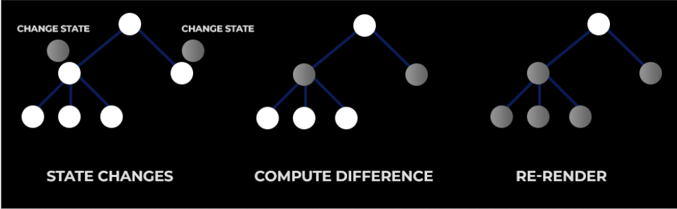
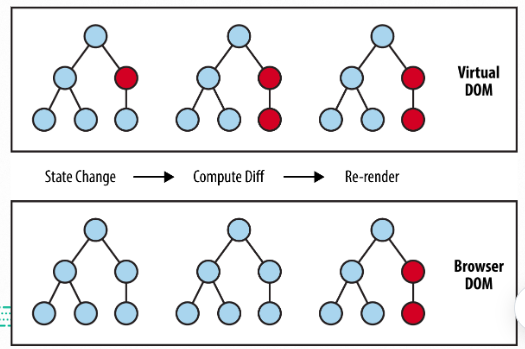
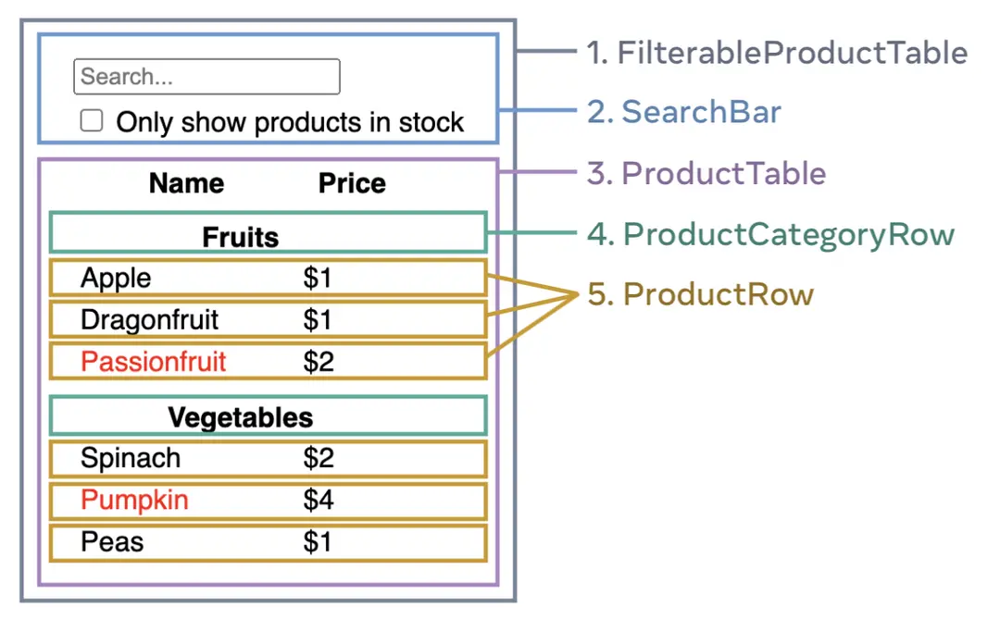
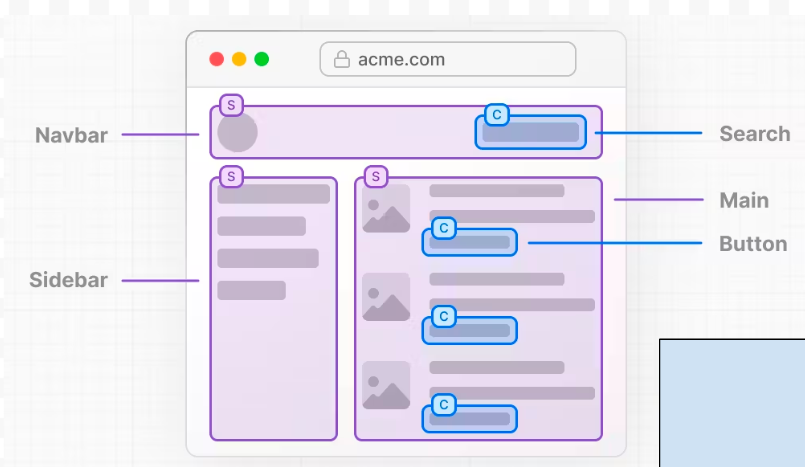
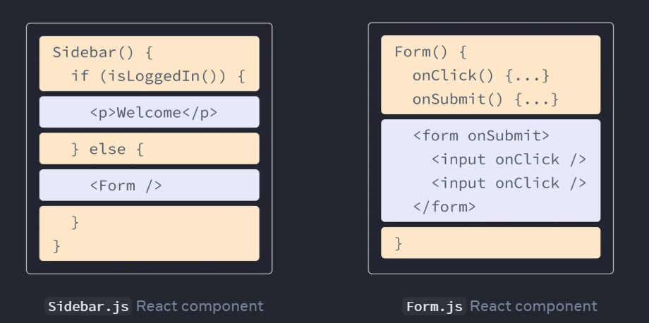
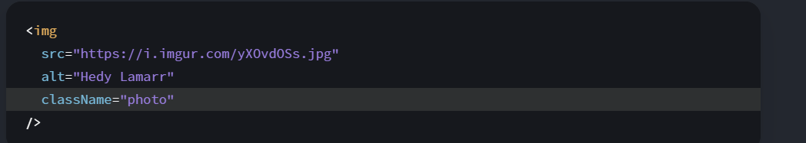

## La historia de React

Es una dependencia que se vasa en componentes mismos que se pueden reutilizar


---


---

## No es un framework
## No es una herramienta de backend 
## No es un remplazo de JS
## No es una solución completa

---

## Virtual DOM

VDOM es una copia del DOM real del Navegador
React hace las actualizaciones al VDOM y hace una actualización de una manera inteligente 

Mediante el *"Algoritmo de Reconciliación en Base a Fibras"*



Lo que hace el algoritmo es identificar que parte se tiene que actualizar
Si se llega a hacer una interaccion con el sitio web cambia el *"ESTADO"*
hace el calculo y depues hace la fase de *"RE-RENDEREO"*

Se encarga de actualizar el componente con un nuevo valor y unicamente se cambia el "Nodo" que se tiene que cambiar debido al calculo que hace el algoritmo 

Mas rapido que JQUERY o dependencias antiguas

Gracias al *VDOM* React se hizo tan popular ya que la representación virtual del DOM hace las actualizaciones primero de el VDOM y despues el DOM real del Navegador

---

## Ejemplo de un usuario empieza a escribir en un input


 
 - El valor del input cambia al momento que se interactua Y empieza a cambiar

 - React en el VDOM cambia el estado cambia el valor del input hace la diferencia , recorre el arbol al buscar el nodo que cambio y al final hace el "re-rendereo" 

 - Y el DOM de el navegador el *"BROWSER DOM"* de la imagen o el dom real solo se actualiza unicamente lo que se tiene que actualizar y por ende
 no se tienen actualizaciones directas y es un re-rendero mas rapido

 ## Dependencias Mas Utilizadas con React para su entorno

 - Vite -> Se encarga de empaquetar todo el codigo y generar una sola salida 

- Redux -> Manejo de "estados globales" toda la información que venga de una API , guardar en un objeto global para acceder 

- Zustand -> Manejo de estado globales mas simple 

- React Router ->  Maneja el Routing para cambiar de una pagina a otra, rutas , navegación entre paginas

- SWR -> React Hooks 

- React Hook Form -> Manejo optimo de los formularios en los componentes , para manejar la informacion de los inputs de algun formulario

- Tailwind -> Para los estilos es rapido y personalizable

- Styled Components -> Te ayuda a inyectar codigo css a un archivo JS para agregar valores o crear estilos para cada uno de los componentes de manera aislada o reusable

- React Spring -> Ayuda a crear animaciones de una manera fluida 

- React Testing Library -> Usado para Testing 

- NEXT JS -> Es el Framework para la web para JS , ya que lo ocupa react para que puedas desplegar componentes de react ya en la WEB

## COMO PENSAR EN COMPONENTES

Primero debemos saber como separar cada cosa dividir lo que tengamos en nuestra *"UI"* para que podamos crear y reutilizar algunos como se muestran en la imagen 





## DIVIDIR TANTOS COMPONENTES SE NECESITAN PARA NUESTRA UI
---

## JSX
Vino a remplazar la manera antigua de que se hacia al crear funciones para cuando el usuario interactura con el sitio

Es una nueva *SIntaxis* que no es propia de REACT y ayuda a colocar HTML dentro de los archivos HTML

Donde se incluye logica 

- Ejemplo de como se ve 



## Convertir HTML a JSX
Solo se tiene que copiar y pegar el HTML y seguir unas reglas

- Solamente se puede regresar un archivo como ruta

Solo puede haber un contenedor que regrese todo no puede haber multiples contenedores ya que se necesita un componente extra

- Todas las tags se tienen que cerrar , en JSX se tiene  que cerrar si no marca error 

- El uso de camelCase en todas las propiedad de las etiquetas HTML se debe de ocupar ejemplo

por ejemplo la etiqueta img en html se ocupa `className` porque es una etiqueta HTML y no detecta `class` por si solo



---
Para convertir componentes o etiquetas de html existen convertidores a JSX

## Componentes 

Para declarar componentes son funciones que regresan codigo de JSX simple

## Existe dos maneras de crear componentes con *Funciones Flechas* o *Funciones tradicionales*  lo mas comun son las {*Funciones Anonimas*}

```jsx

// Funcion Flecha 
const MyFirst Component = () =>{

};

// Funcion Tradicional
function MyFirstComponent2 (){

}

// Unicamente se pueden exportar una sola cosa
export default MyFirstComponent;

```

Lo que importa es lo que regresas y que viva dentro de una función, ya que una función cuando REGRESA codigo de JSX se convierte en un COMPONENTE

---

## Creando el primer Componente
- Al crear el componente debemos de crear el archivo con el nombre de el componente y la función deben de ser los mismos 

## El nombre de el archivo sera : MyFirstComponent.jsx

```jsx
const MyFirstComponent = () => {
  const hola = 'Hola';

  return <div>{hola} este es mi primer componente</div>;
};

export default MyFirstComponent;


```

Para este ejemplo solo creamos un div con el texto de Hola este es mi primer componente y lo vamos a exportar a la vista principal 

en el archivo principal con el nombre *App.jsx* necesitamos *IMPORTAR*
el componente a la vista que es la que se esta ejecutando

## Nombre de el archivo App.jsx

```jsx
// El nombre de el archivo va a depender de donde este ubicado el componente 

import MyFirstComponent from './MyFirstComponent';

function App() {
  const [count, setCount] = useState(0);

  return (
    <>
      <section id="center">
        <div className="hero"></div>
        <div>
            {/*Este es el componente que se estaria importando */}
          <MyFirstComponent />
        </div>
        <button
          className="counter"
          onClick={() => setCount((count) => count + 1)}
        >
          Count is {count}
        </button>
      </section>
      <div className="ticks"></div>
      <section id="spacer"></section>
    </>
  );
}

export default App;

```
Aqui tenemos el ejemplo de como se esta *IMPORTANDO* el componente para esta vista que tenemos ya un contandor unicamente con el texto de este es mi primer componente .

---

## Reactividad

Es la capacidad que tienen los componentes de reaccionar o su reactividad ya que con una actualización el componente vuelve a llamarse a si mismo 

Ah actualizarse a si mismos

## State(Estados)

Los estados se componen de lo siguiente de una importacion de una libreria de react que es 

```jsx
import {useState } from 'react';
```

Es una funcion que se manda a llamar y te permite obtener un valor y setearlo(Actualizarlo) cada que se necesite

---

```jsx
import { useState } from 'react';

const MyFirstComponent = () => {
  const [value, setValue] = useState(0);

  const hola = 'Hola';

  {
    /* Este set time out se ocupo para que se llamara el valor del useState
setTimeout(() => {
    setValue(value + 1);
  }, 2000);
*/
  }

  return (
    <div>
      {hola} este es mi primer componente {value}
    </div>
  );
};

export default MyFirstComponent;
```

El uso de la funcion *useState nos ayuda a que podamos hacer reactivo el componente que se este tomando para mantener valores de estado y setearlo
para que se vuelva a llamar y sea el valor siempre actualizado

```jsx
{/*EL uso de los los valores iniciales y setters hacen que el componente se actualice de una manera inmutable   */}

const [value, setValue] = useState(0);
const [hola, setHola] = useState('hola');

 return (
    <div>
      {hola} este es mi primer componente {value}
    </div>
  );

```
## Inmutabilidad

CUando hace un cambio de estado 
- Evita errores no intencionados en nuestro código
- Juega un rol crucial al momento de actualizar un componente de React
- Facilita la implementacion de debugging , rehacer y deshacer

React ocupa la inmutabilidad usando *ArrayDestructuring* que es el setState, cuando se manda a llamar el estado despues el setter y cuando lo mandas a llamar internamente aplica la inmutabilidad , actualizando unicamente el estado de el componente sin afectar a todo el componente haciendolo de una manera limpia y eficiente

```jsx
const[,setState] = useState()
```

---

## Props

Los atributos que se agregan para los componentes propios como *propiedades* y para declararlos se deben de definir en la funcion en este ejemplo la de *"MyFirstComponent"* tenemos 
- propOne , propTwo , propThree

```jsx

const MyFirstComponent = ({ propOne, propTwo, propThree }) => {
  const [value, setValue] = useState(0);
  const [hola, setHola] = useState('hola');

  console.log('My FirstComponent Render');

  return (
    <div id="1" className="myclassname">
      {hola} este es mi primer componente {value}
    </div>
  );
};


```

En este caso para mandar la propiedad se pueden ser llamadas cuando el componente se esta utilizando 

se mandaria en este caso de la App.jsx

```jsx

function App() {
  const [value, setValue] = useState(0);
  
  const [count, setCount] = useState(0);

  setTimeout(() => {
    setValue(value + 1);
  }, 5000);

  console.log('App rendered');
  return (
    <>
      <section id="center">
        <div className="hero"></div>
        <div>
          <MyFirstComponent propOne={value} propTwo={2} propThree={{}} />
        </div>
        <button
          className="counter"
          onClick={() => setCount((count) => count + 1)}
        >
          Count is {count}
        </button>
      </section>
      <div className="ticks"></div>
      <section id="spacer"></section>
    </>
  );
}

```
Si el componente prinicipal tuviera un componente reactivo , se le pasa el valor del estado en este caso a *propOne={value}* y cuando se le pasa el valor de la propiedad 


Cuando se actualiza la propiedad principal se actualiza tambien la desendencia en este caso propOne esta cambiando y haciendo un re-renderero pero solo se actualiza el elemento que tenemos no se actualiza todos los componentes


Entonces con los console log de 
```jsx
    console.log('App rendered');

    console.log('My FirstComponent Render');
```

Se actualiza el padre y por ende se actualiza los decendientes
y asi es como se actualiza embase a lo que se actualiza

OJO : Si se actualiza algo que no se debe de actualizar o es muy pesado el Performance puede llegar a bajar 

